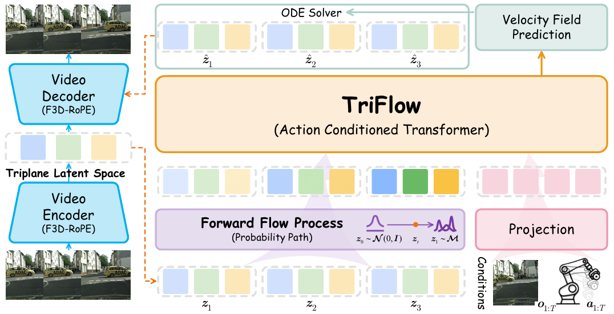
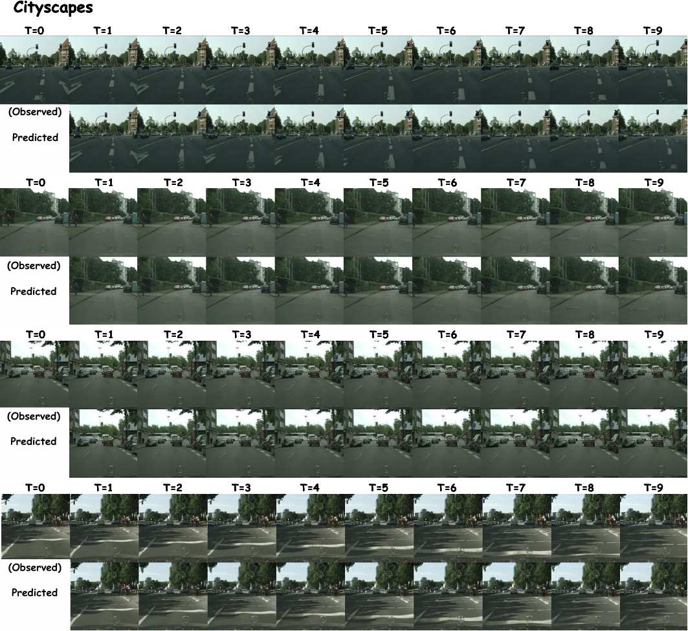
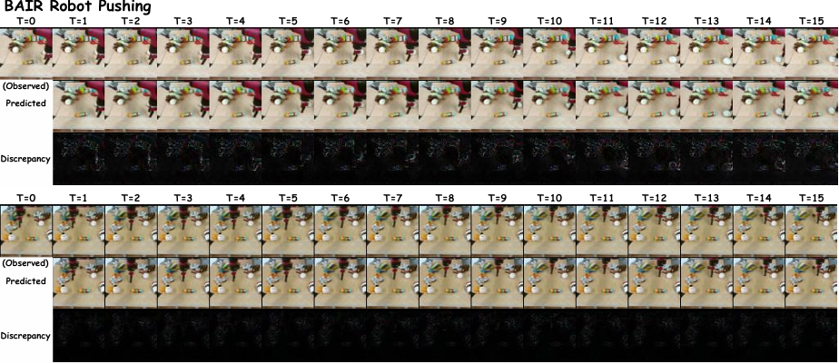

# 🎥 TriFlow: Efficient Video Generation with Latent Triplane Flow Matching

 
 
[](https://huggingface.co/collections/wsmumumu/triflow)


**TriFlow** is an efficient framework for video generation that harmonizes a spatiotemporally structured latent triplane representation with a flow-based transformer. Addressing the trade-off between structural coherence and computational efficiency in existing Latent Video Diffusion Models (LVDMs), TriFlow proposes the following core innovations:

* **F3D-ROPE (Factorized 3D Rotary Positional Embedding):** Explicitly injects orthogonal axis information into the latent space, ensuring strict spatiotemporal consistency during compression.
* **Action-Conditioned Transformer:** Equipped with plane-aware segment embeddings to learn complex dynamics within a unified parameter space.
* **Conditional Flow Matching:** Models the generation process via efficient optimal transport paths, significantly accelerating inference speed (approx. **8.5x faster** than SyncVP on Cityscapes).

Experiments demonstrate that TriFlow establishes a new state-of-the-art on **Cityscapes**, **BAIR Robot Pushing**, and **OpenDV-YouTube** datasets while maintaining high sampling efficiency.

---

## ⚙️ Installation

It is recommended to use Anaconda to create a virtual environment.

### 1. Create Environment

```bash
conda create -n TriFlow python=3.10 -y
conda activate TriFlow

pip install -r requirements.txt
```


## 📦 Data Preparation


Preprocessed version of Cityscapes at 128x128 resolution with disparity (depth) maps can be downloaded [here](https://uni-bonn.sciebo.de/s/H7ke289qsY4I3lV).


## 🚀 Training
TriFlow training is divided into two stages: VAE compression training and Transformer generation model training.


### Stage 1: Train F3D-ROPE Triplane VAE

```bash
CUDA_VISIBLE_DEVICES=0,1,2,3 python3 main.py --config config_run/train_vae/vae_city_rgb.yaml --num_workers 8
```

### Stage 2: Train Flow Matching Transformer

```bash
CUDA_VISIBLE_DEVICES=4,5,6,7 python3 main.py --config config_run/train_fm/fm_city_rgb.yaml --num_workers 8
```


## 🎥 Inference & Evaluation
Run video prediction using the pre-trained model:

```bash
python inference.py \
    --model_path logs/transformer/checkpoint \
    --condition_frames {path_to_start_frame} \
    --sampling_steps 50 \
    --guidance_scale 4.0
```

TriFlow supports Classifier-Free Guidance (CFG) to enhance generation quality, especially in long-term video prediction.






## 💡 Acknowledgement
This project references code from [PallottaEnrico/SyncVP](https://github.com/PallottaEnrico/SyncVP) and [willisma/SiT](https://github.com/willisma/SiT). We thank the original authors for their contributions.

## 📝 License
This project is licensed under the MIT License - see the LICENSE file for details.

Copyright (c) 2026. All rights reserved.

This repository contains modified components from the [SyncVP](https://github.com/PallottaEnrico/SyncVP) and [SiT](https://github.com/willisma/SiT) projects. These modifications are provided under the MIT License, which allows for commercial use, distribution, modification, and private use, under the conditions specified in the license.

By using this repository, you agree to the terms of the MIT License, including the disclaimers and limitations of liability.

Note: The original authors of SyncVP and SiT are not responsible for the modifications made in this repository.


